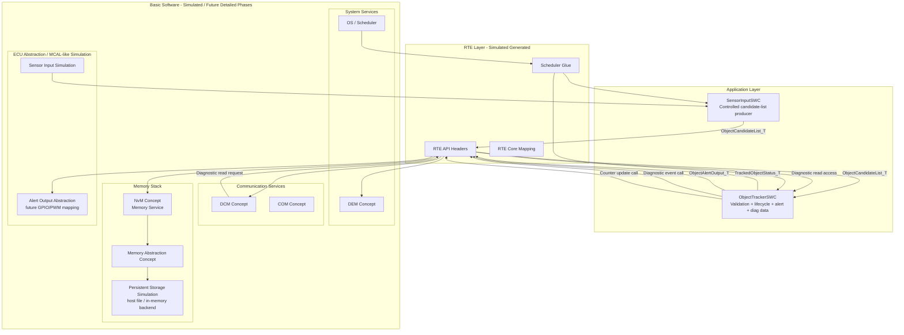

# Phase 3 — SWC Architecture

**Project:** `autosar-object-tracking-diagnostics-ecu`  
**Phase:** 3 — SWC Architecture  
**Status:** Draft v3  
**Baseline input:** Phase 2 Requirements Engineering baseline

---

## 1. Purpose

This document translates the committed Phase 2 requirements baseline into the first AUTOSAR Classic-inspired Software Component architecture.

Phase 3 defines:

```text
Application SWCs
SWC responsibilities
ports
interfaces
data types
runnables
events
representative ARXML mapping
generated-style RTE contract expectations
requirement-to-architecture traceability
```

This phase does not implement final source code, BSW modules, OS scheduling, or production AUTOSAR generation.

---

## 2. Completion Status

Phase 3 is **not complete** until the architecture package is reviewed and accepted.

```text
Phase 3 status: Draft v3 ready for review
Gate state: Not yet passed
Expected next action: Review and approve or request final corrections
```

---

## 3. Architecture Alignment Decision

The repository baseline identifies two Application Layer SWCs:

```text
SensorInputSWC
ObjectTrackerSWC
```

Diagnostics are modeled as DCM/DEM/NvM-style BSW concepts accessed through RTE-style interfaces. Therefore, Phase 3 shall not introduce a third Application SWC for diagnostic adaptation.

Diagnostic read behavior is represented as:

```text
DCM-style diagnostic request
→ RTE-style read/access path
→ ObjectTrackerSWC diagnostic read operation
→ selected diagnostic response data
```

---

## 4. Professional AUTOSAR Emulation Policy

In a real AUTOSAR Classic workflow, engineers usually define the software model first:

```text
SWCs
ports
interfaces
data types
runnables
events
composition connectors
ECU configuration
```

ARXML is then the machine-readable representation of that model and can be used by AUTOSAR tools to generate RTE/configuration artifacts.

This project emulates that sequence honestly:

```text
Requirements baseline
↓
SWC model
↓
representative ARXML fragments
↓
generated-style RTE contract preview
↓
manual educational implementation
```

The repository does not claim production AUTOSAR compliance. The ARXML files are representative educational artifacts.

---

## 5. Phase 2 Baseline Inputs

| Area | Locked Phase 2 decision |
|---|---|
| Maximum candidates | `kMaxObjectCandidates = 8` |
| Main runnable period | `10 ms` |
| Candidate decisions | `Accepted`, `Rejected`, `Ignored` |
| Tracking lifecycle states | `Inactive`, `Tentative`, `Active`, `Coasting`, `Lost` |
| Confirmation rule | `2 detections within 3 cycles` |
| Deletion rule | `5 missed cycles` |
| Candidate list source status | `Good`, `Degraded`, `Invalid`, `Timeout` |
| Candidate quality | `Good`, `Degraded`, `Invalid`, `Timeout` |
| Primary object policy | shortest distance, highest confidence, highest closing velocity, lowest ID |
| Runtime persistence | active object state, ID, confidence, missed cycles are RAM-only |
| NvM-style persistence | false-positive counter, accepted-object counter, selected diagnostic history |
| Diagnostic concept | DEM-style events and DCM-style diagnostic reads |
| Alert concept | `ObjectAlertOutput_T` is application-level, not direct hardware |

---

## 6. Application SWCs

The Application Layer shall contain two AUTOSAR-inspired SWCs:

```text
SensorInputSWC
ObjectTrackerSWC
```

### 6.1 SensorInputSWC

**Responsibility:**  
Provide a bounded `ObjectCandidateList_T` to the application layer through an RTE-style Sender-Receiver interface.

**Purpose in the MVP:**  
Act as a controlled simulation producer for upstream perception output.

In this educational project, `SensorInputSWC` may generate candidate lists from fixed scenarios, test vectors, or later from a simple input file. That does not mean it owns real perception logic. It only provides representative upstream input so the tracker can be executed and tested.

| Responsibility | Meaning |
|---|---|
| Candidate-list production | Creates or loads a bounded candidate list for the current cycle. |
| Source status assignment | Sets `SensorSourceStatus_T` to model whether the list/source is usable, degraded, invalid, or timed out. |
| Timestamp assignment | Provides list timing metadata for freshness checks. |
| Scenario simulation | Provides deterministic input scenarios for demo, tests, and integration. |

**Out of scope:**

```text
raw sensor processing
real LiDAR/radar/camera perception
object detection
Kalman filtering
candidate validation
tracking lifecycle
diagnostic counter ownership
DEM/DCM/NvM internals
hardware sensor drivers
```

### 6.2 ObjectTrackerSWC

**Responsibility:**  
Implement the core object-candidate validation and simplified tracking behavior.

**Purpose in the MVP:**  
Represent the main application feature of the Object Tracking Diagnostics ECU.

| Responsibility | Meaning |
|---|---|
| Candidate validation | Applies validation policy to each received candidate. |
| Candidate decision assignment | Assigns `Accepted`, `Rejected`, or `Ignored` per candidate, per cycle. |
| Primary object selection | Selects one primary object when multiple candidates are accepted. |
| Tracking lifecycle | Updates `Inactive`, `Tentative`, `Active`, `Coasting`, and `Lost` state. |
| RAM-only tracking state | Maintains current object ID, confidence, missed cycles, and active state. |
| Diagnostic trigger decisions | Requests DEM-style events and NvM-style counter updates through RTE calls. |
| Alert decision | Writes `ObjectAlertOutput_T` through the RTE path. |
| Diagnostic read data | Provides selected tracking data when the DCM-style path requests it. |

**Out of scope:**

```text
raw sensor processing
object detection
Kalman filtering
DEM storage internals
DCM protocol internals
NvM storage internals
COM stack internals
GPIO/PWM/hardware alert control
```

---

## 7. BSW and Infrastructure Boundary

| Concept | Layer / future module |
|---|---|
| DCM-style diagnostic read service | BSW Communication Services |
| DEM-style event service | BSW System Services |
| NvM-style counter persistence | BSW Memory Services |
| Persistent storage simulation | Simplified memory abstraction/storage backend |
| OS / scheduler | BSW System Services |
| COM | BSW Communication Services |
| GPIO/PWM alert mapping | ECU Abstraction / MCAL-like layer |

Persistent storage simulation is intentionally not owned by `ObjectTrackerSWC`. The SWC requests counter updates through the RTE/NvM-style path; the storage backend is an infrastructure concern.

---

## 8. Architecture Diagram



---

## 9. Why Keep `swc_architecture.mmd` If the Diagram Is Also Embedded Here?

The Markdown document includes the diagram for readability during document review.

The `.mmd` file is still useful because it is the source artifact for:

```text
rendered SVG/PNG diagrams
LaTeX publication
Medium/GitHub article reuse
diagram diff review
automated rendering later
```

---

## 10. Key Architecture Decisions

| Decision ID | Decision |
|---|---|
| `DEC-P3-001` | Keep a two-SWC Application Layer: `SensorInputSWC` and `ObjectTrackerSWC`. |
| `DEC-P3-002` | Do not introduce `DiagnosticAdapterSWC` in Phase 3. |
| `DEC-P3-003` | Model diagnostic reads through `ObjectTrackerSWC` diagnostic operations and DCM-style BSW access. |
| `DEC-P3-004` | Use Sender-Receiver communication for candidate list, tracking status, and alert output. |
| `DEC-P3-005` | Use Client-Server style calls for diagnostic events, counter updates, and diagnostic reads. |
| `DEC-P3-006` | Keep DEM, DCM, NvM, OS, COM, persistent storage simulation, and hardware abstraction outside Application SWC scope. |
| `DEC-P3-007` | Create representative ARXML after defining the SWC model, not before. |
| `DEC-P3-008` | Treat `SensorInputSWC` as a controlled simulation producer, not as a perception algorithm. |
