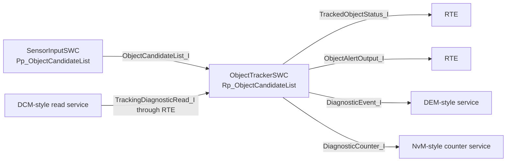

# SWC Interfaces and Ports

**Project:** `autosar-object-tracking-diagnostics-ecu`  
**Phase:** 3 — SWC Architecture  
**Status:** Draft v3

---

## 1. Purpose

This document defines the ports and interfaces used by the two Application Layer SWCs.

AUTOSAR-inspired terminology:

```text
P-Port  = Provided port
R-Port  = Required port
S/R     = Sender-Receiver communication
C/S     = Client-Server communication
```

---

## 2. Interface Summary

| Interface | Pattern | Data / Operation | Purpose |
|---|---|---|---|
| `ObjectCandidateList_I` | Sender-Receiver | `ObjectCandidateList_T` | Sends candidate lists from `SensorInputSWC` to `ObjectTrackerSWC`. |
| `TrackedObjectStatus_I` | Sender-Receiver | `TrackedObjectStatus_T` | Sends tracker lifecycle/status output. |
| `ObjectAlertOutput_I` | Sender-Receiver | `ObjectAlertOutput_T` | Sends application-level alert output. |
| `DiagnosticEvent_I` | Client-Server | `ReportDiagnosticEvent()` | Reports DEM-style diagnostic events. |
| `DiagnosticCounter_I` | Client-Server | `IncrementCounter()`, `ReadCounter()`, `ResetCounters()` | Provides access to persistent diagnostic counters. |
| `TrackingDiagnosticRead_I` | Client-Server | `ReadTrackingStatus()`, `ReadLastObjectConfidence()`, `ReadTrackingSnapshot()` | Provides application diagnostic read data to the DCM-style service path. |

---

## 3. SensorInputSWC Ports

| Port | Direction | Interface | Meaning |
|---|---|---|---|
| `Pp_ObjectCandidateList` | P-Port | `ObjectCandidateList_I` | Provides the current object-candidate list. |

---

## 4. ObjectTrackerSWC Ports

| Port | Direction | Interface | Meaning |
|---|---|---|---|
| `Rp_ObjectCandidateList` | R-Port | `ObjectCandidateList_I` | Reads candidate list. |
| `Pp_TrackedObjectStatus` | P-Port | `TrackedObjectStatus_I` | Provides lifecycle/status output. |
| `Pp_ObjectAlertOutput` | P-Port | `ObjectAlertOutput_I` | Provides alert output. |
| `Rp_DiagnosticEvent` | R-Port | `DiagnosticEvent_I` | Reports invalid/timeout events. |
| `Rp_DiagnosticCounter` | R-Port | `DiagnosticCounter_I` | Updates and reads persistent counters through RTE/BSW path. |
| `Pp_TrackingDiagnosticRead` | P-Port | `TrackingDiagnosticRead_I` | Provides read operations for DCM-style diagnostic access. |

---

## 5. Port Connection View



---

## 6. Design Rules

```text
Application SWCs shall not call low-level drivers directly.
Application SWCs shall communicate through RTE-style access functions.
Diagnostic events and counters shall use Client-Server style calls.
Status and object data shall use Sender-Receiver style communication.
Diagnostic read data shall be provided by ObjectTrackerSWC and transported through a DCM-style BSW path.
```
