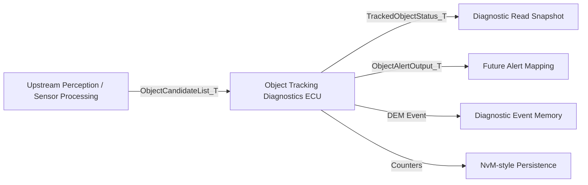
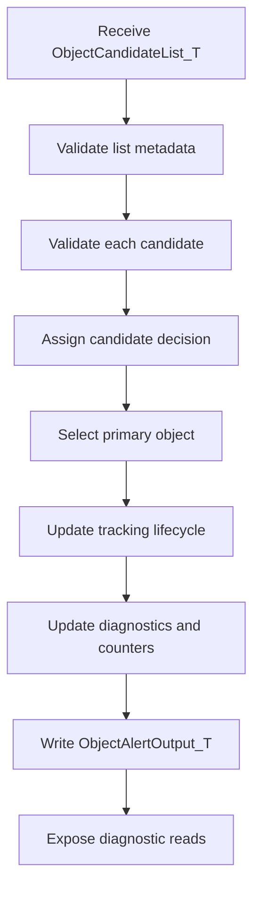
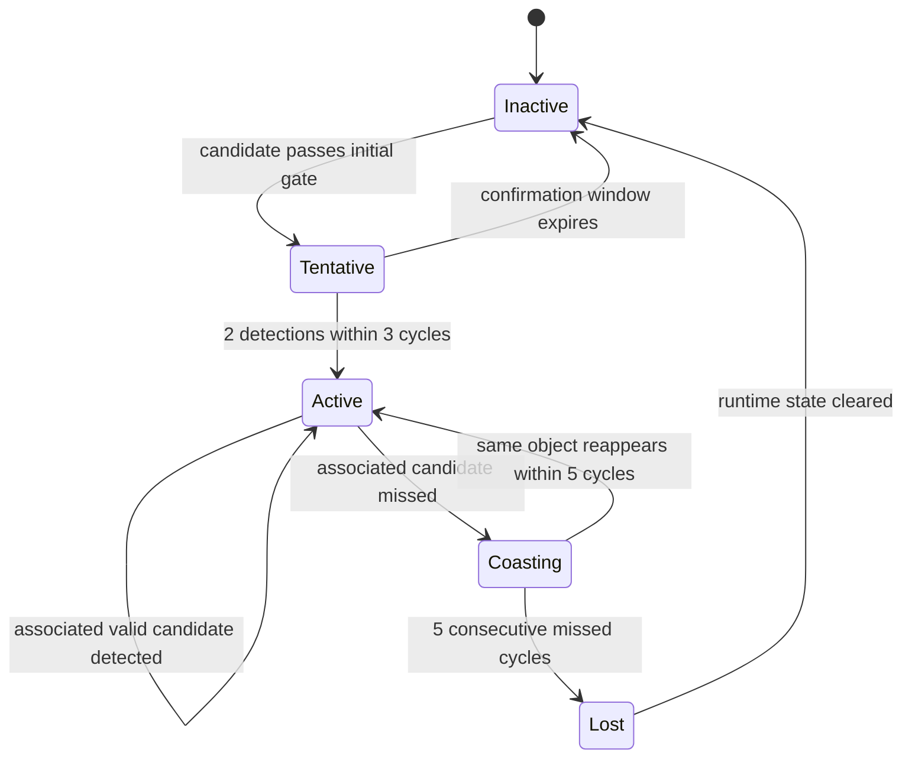

# Functional Concept — Object Tracking Diagnostics ECU

**Project:** `autosar-object-tracking-diagnostics-ecu`  
**Phase:** 2 — Requirements Engineering  
**Status:** Draft v2  
**Document role:** Functional concept / R&D-style feature explanation

---

## 1. Purpose

This document explains the functional intent of the Object Tracking Diagnostics ECU before the reader enters the detailed requirements list.

The ECU is an AUTOSAR Classic-inspired educational simulation that receives a bounded list of object candidates from an upstream perception or sensor-processing module, validates those candidates cyclically, maintains a simplified tracking lifecycle, updates diagnostic information, and exposes the resulting state through RTE-style and BSW-style interfaces.

In this document, **MVP** means **Minimum Viable Product**. It refers to the first intentionally limited version of the ECU function: enough behavior to demonstrate the architecture, requirements, lifecycle, diagnostics, scheduler, and tests without implementing a full production tracking stack.

This document is not a production customer specification. It is a portfolio-grade R&D functional concept designed to connect:

```text
feature intent
→ requirements
→ architecture
→ code
→ tests
→ traceability evidence
```

---

## 2. Problem Statement

The project answers the following engineering question:

```text
How can an ECU validate object candidates, maintain a clear object-tracking lifecycle,
expose diagnostic information, and preserve software-layer boundaries in an
AUTOSAR Classic-inspired architecture?
```

---

## 3. Functional Scope

The MVP focuses on:

```text
bounded candidate input reception
deterministic candidate validation
primary object selection
object tracking lifecycle management
diagnostic event reporting
diagnostic read snapshots
persistent diagnostic counters
10 ms runnable execution
RTE-style access
BSW-style service separation
```

The MVP does not implement:

```text
raw LiDAR/radar/camera processing
full object detection
full sensor fusion
Kalman filtering
Hungarian assignment
production AUTOSAR generation
production safety or cybersecurity qualification
```

---

## 4. System Context



The upstream module owns raw perception and initial object candidate generation. This ECU owns candidate validation, simplified lifecycle management, diagnostic reporting, and output abstraction.

---

## 5. Functional Processing Chain



---

## 6. Object Tracking Lifecycle Concept

The ECU maintains one primary tracking lifecycle:

```text
Inactive
Tentative
Active
Coasting
Lost
```

The lifecycle does not represent every candidate in the input list. It represents the state of the **primary tracked object** selected by the ECU after candidate validation and risk prioritization.



---

## 7. Candidate Decision Concept

Each candidate processed during a 10 ms cycle receives a **candidate decision**:

```text
Accepted
Rejected
Ignored
```

This decision is assigned **after the validation policy is executed for that candidate**. It is a per-cycle classification, not the same thing as the persistent tracking lifecycle state.

The decision may change from one cycle to the next because the input values can change.

Examples:

| Previous cycle | Current cycle | Reason |
|---|---|---|
| `Ignored` | `Accepted` | Candidate becomes old/stable enough and confidence increases. |
| `Accepted` | `Ignored` | Candidate remains valid but is no longer the primary object. |
| `Accepted` | `Rejected` | Candidate quality becomes `Invalid` or `Timeout`. |
| `Rejected` | `Accepted` | A previously unreliable candidate reappears with valid quality and confidence. |

The relationship is:

```text
Candidate decision
→ describes the current-cycle result for one candidate

Tracking lifecycle state
→ describes the ongoing state of the selected primary object
```

This distinction prevents confusion between a candidate being accepted in one cycle and an object becoming permanently active.

---

## 8. Diagnostic Concept

Diagnostics are used to explain the ECU behavior, not to diagnose every object disappearance.

The diagnostic model supports:

```text
invalid or timeout source/candidate quality events
persistent false-positive counter
persistent accepted-object counter
tracking status read
last confidence read
diagnostic snapshot read
```

The diagnostic snapshot is intended to provide an engineering/debug view of the current tracking state. It is not a raw dump of every internal variable. It contains selected, requirement-relevant values that help explain why the ECU is active, inactive, coasting, or reporting a diagnostic event.

---

## 9. Product-Development Interpretation

In a real company, this document would usually sit before or beside the detailed requirements list. Depending on the organization, it could be called a functional concept, feature concept, functional specification, product requirements document, or system feature description.

For this project, the intended flow is:

```text
Functional Concept
↓
Requirements
↓
Architecture
↓
Software Design
↓
Code
↓
Tests
↓
Evidence
```

The requirements should demonstrate how each technical behavior supports the functional intent described here.
