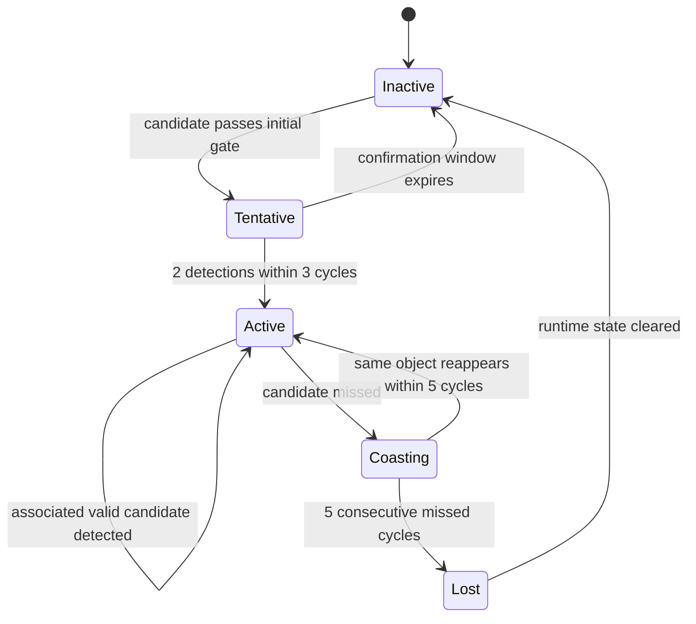

# Tracking Lifecycle Requirements

**Project:** `autosar-object-tracking-diagnostics-ecu`  
**Phase:** 2 — Requirements Engineering  
**Status:** Draft v2

---

## 1. Lifecycle Overview

Lifecycle states:

```text
Inactive
Tentative
Active
Coasting
Lost
```

The lifecycle describes the primary tracked object, not every candidate in the input list.



---

## REQ-TRACK-001 — Initial State

At ECU startup, the tracking lifecycle shall initialize to `Inactive`.

Initialization shall set:

```text
tracking_state = Inactive
primary_object_id = invalid
last_confidence_percent = 0
confidence_valid = false
missed_cycles = 0
```

---

## REQ-TRACK-002 — Inactive to Tentative

The lifecycle shall transition from `Inactive` to `Tentative` when at least one candidate passes the initial validation gate.

Initial validation gate:

```text
source status is not Invalid or Timeout
candidate quality is Good or Degraded
candidate distance is within the physical valid range
candidate is inside the region of interest
candidate confidence is above the tentative threshold
candidate age is at least the minimum age
```

---

## REQ-TRACK-003 — Tentative to Active

The lifecycle shall transition from `Tentative` to `Active` when the same object, or an associated candidate, is detected at least 2 times within 3 consecutive cycles.

---

## REQ-TRACK-004 — Tentative to Inactive

The lifecycle shall transition from `Tentative` to `Inactive` if the candidate fails to satisfy the confirmation rule within 3 cycles.

---

## REQ-TRACK-005 — Active to Active

The lifecycle shall remain in `Active` when an associated valid candidate is detected in the current cycle.

While remaining active, the ECU shall update:

```text
primary_object_id
last_confidence_percent
confidence_valid = true
missed_cycles = 0
object_alert_state
```

---

## REQ-TRACK-006 — Active to Coasting

The lifecycle shall transition from `Active` to `Coasting` when the active object is not associated with a valid candidate in the current cycle.

---

## REQ-TRACK-007 — Coasting to Active

The lifecycle shall transition from `Coasting` back to `Active` if the same object, or an associated candidate, reappears before the missed-cycle threshold expires.

Initial MVP association rule:

```text
same object_id within kMaxMissedCycles
```

---

## REQ-TRACK-008 — Coasting to Lost

The lifecycle shall transition from `Coasting` to `Lost` after 5 consecutive missed cycles.

---

## REQ-TRACK-009 — Lost to Inactive

The lifecycle shall transition from `Lost` to `Inactive` after runtime cleanup is complete.

Cleanup shall include:

```text
clear primary_object_id
clear confidence_valid
set last_confidence_percent = 0
set missed_cycles = 0
set active object flag = false
```

---

## REQ-TRACK-010 — Candidate Decision Versus Lifecycle State

Candidate decisions shall be treated as per-cycle validation results.

Tracking lifecycle states shall be treated as multi-cycle object state.

The software shall not use `Accepted`, `Rejected`, or `Ignored` as replacements for lifecycle states.
